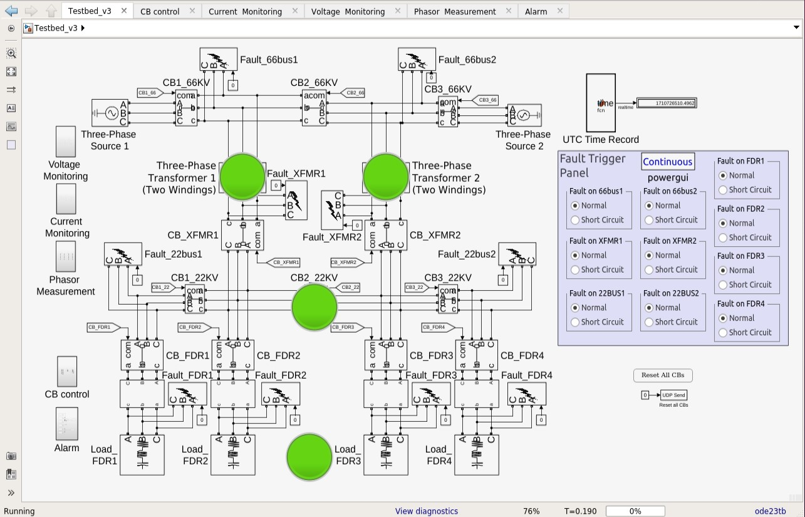

## Testbed essential scripts

The testbed simulates a small-scale smart zone substation based on the IEC 61850 standard, including the primary plant (physical process), three protective relays (Intelligent electronic devices), two Merging units (MUs), the process bus communication (IEC 61850 GOOSE and SV protocols), the station bus communication (IEC 61850 MMS protocol), and a human-machine interface (HMI). Figures 1 and 2 demonstrate the overall architecture and communication design of the simulation testbed.

*Figure 1. Architecture and communication design of the simulation testbed (station bus part)*

*Figure 2. Architecture and communication design of the simulation testbed (process bus part)*

The testbed runs on an Oracle VirtualBox with five virtual machines (VMs). One VM simulates a small-scale primary plant of a zone substation using [**MATLAB/Simulink** shown in Figure 3](https://www.mathworks.com/products/simulink). The other three VMs represent three instantaneous-overcurrent-protection relays using [**OpenPLC**](https://www.openplcproject.com). Communication protocols (GOOSE, SV and MMS) among IEDs, MUs and the primary plant, are written in C++ based on an open-source library - [**libiec61850**](http://libiec61850.com). The last VM acts as the layer 2 network switch in the process bus and the layer 3 router in the station bus.

*Figure 3. The primary plant simulation in MATLAB*

**Each folder/directory contains various essential scripts for one particular Virtual Machine. These include:**
- Primary plant: the physical process
- IED_PIOC_XFMR1: the overcurrent protection IED/relays for transformer1
- IED_PIOC_XFMR2: the overcurrent protection IED/relays for transformer2
- IED_PIOC_FDR: the overcurrent protection IED/relays for feeders
- IED_HMI: the human-machine interface for controlling IEDs
- Net_Device: the network device used for both the process bus and stations bus, as well as for data collection and intrusion detection purposes

> Port summary.xlsx: indicates all the UDP port numbers for communication between Simulink and OpenPLC

> **Sincerely thanks [Thiago Alves](https://github.com/thiagoralves) for helping me solve issues regarding OpenPLC_Simulink-Interface.**